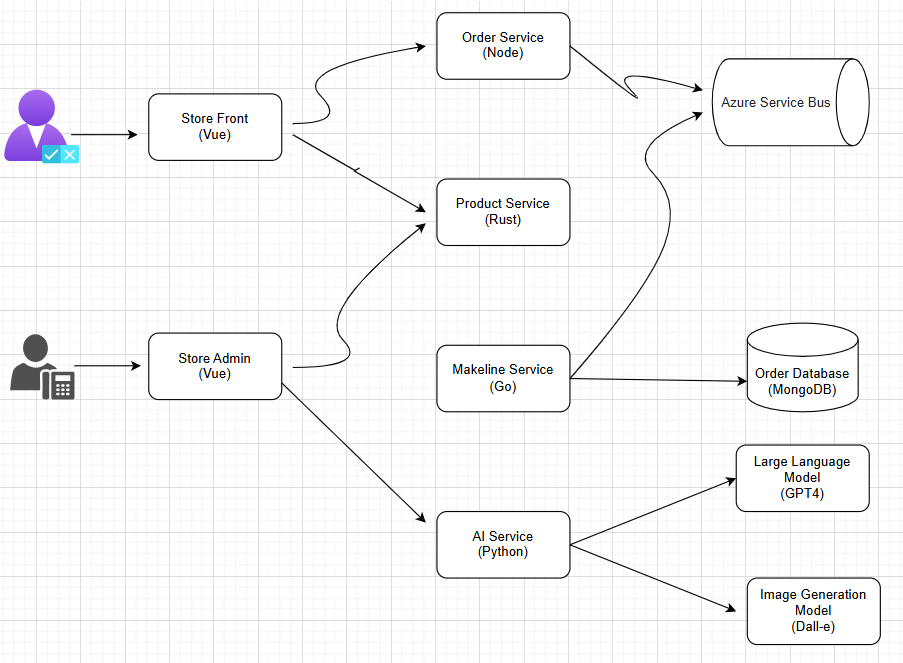

# Building a Cloud-Native App for Best Buy
## Updated Application Architecture



## Application and Architecture Explanation

The Best Buy application is a microservices-based, containerized architecture that can be deployed to a Kubernetes cluster. The design emphasizes polyglot programming, event-driven communication, and integration with AI services to enhance functionality. Here's a breakdown of how the application works: 

### 1.Store Front (Vue):
* Acts as the customer-facing interface.
*Users can browse products, place orders, and interact with the platform.

### 2.Store Admin (Vue):
* Provides store administrators with a management interface for order tracking and product catalog management.

### 3.Order Service (Node):
* Manages customer orders, including their creation and updates.
* Communicates asynchronously via Azure Service Bus for seamless order processing.

### 4.Product Service (Rust):
* Handles product-related functionalities such as catalog updates and inventory management.
* Works in conjunction with the Order Service and Store Front to provide up-to-date product data.

### 5.Makeline Service (Go):
* Coordinates the fulfillment pipeline, ensuring orders are processed and tracked efficiently.
* Updates the Order Database (MongoDB) and interacts with other microservices for real-time processing.

### 6.AI Service (Python):
* Uses OpenAI's GPT-4 model to generate product descriptions, improving the content quality of the storefront.
* Integrates with the DALL-E model to generate product images for a visually engaging user experience.

### 7.Order Database (MongoDB):
* Serves as the primary data store for orders, maintaining a scalable and efficient backend for order-related data.

### 8.Azure Service Bus:
* Acts as the backbone for event-driven communication between microservices, ensuring reliability and decoupled interactions.

## Deployment Instructions

1. **Log in to Azure Portal:**
   - Go to [https://portal.azure.com](https://portal.azure.com) and log in with your Azure account.

2. **Create a Resource Group:**
   - In the Azure Portal, search for **Resource Groups** in the search bar.
   - Click **Create** and fill in the following:
     - **Resource group name**: `AlgonquinPetStoreRG`
     - **Region**: `Canada`.
   - Click **Review + Create** and then **Create**.

3. **Create an AKS Cluster:**
   - In the search bar, type **Kubernetes services** and click on it.
   - Click **Create** and select **Kubernetes cluster**
   - In the `Basics` tap fill in the following details:
     - **Subscription**: Select your subscription.
     - **Resource group**: Choose `AlgonquinPetStoreRG`.
     - **Cluster preset configuration**: Choose `Dev/Test`.
     - **Kubernetes cluster name**: `AlgonquinPetStoreCluster`.
     - **Region**: Same as your resource group (e.g., `Canada`).
     - **Availability zones**: `None`.
     - **AKS pricing tier**: `Free`.
     - **Kubernetes version**: `Default`.
     - **Automatic upgrade**: `Disabled`.
     - **Automatic upgrade scheduler**: `No schedule`.
     - **Node security channel type**: `None`.
     - **Security channel scheduler**: `No schedule`.
     - **Authentication and Authorization**: `Local accounts with Kubernetes RBAC`.
   - In the `Node pools` tap fill in the following details:
     - Select **agentpool**. Optionally change its name to `masterpool`. This nodes will have the controlplane.
        - Set **node size** to `D2as_v4`.
        - **Scale method**: `Manual`
        - **Node count**: `1`
        - Click `update`
     - Click on **Add node pool**:
        - **Node pool name**: `workerspool`.
        - **Mode**: `User` 
        - Set **node size** to `D2as_v4`.
        - **Scale method**: `Manual`
        - **Node count**: `2`
        - Click `add`
   - Click **Review + Create**, and then **Create**. The deployment will take a few minutes.

4. **Connect to the AKS Cluster:**
   - Once the AKS cluster is deployed, navigate to the cluster in the Azure Portal.
   - In the overview page, click on **Connect**. 
   - Select **Azure CLI** tap. You will need Azure CLI. If you don't have it: [**Install Azure CLI**](https://learn.microsoft.com/en-us/cli/azure/install-azure-cli?view=azure-cli-latest)
   - Login to your azure account using the following command:
      ```
      az login
      ```
   - Set the cluster subscription using the command shown in the portal (it will look something like this):
      ```
      az account set --subscription 'subscribtion-id'
      ```

   - Copy the command shown in the portal for configuring `kubectl` (it will look something like this):
     ```
     az aks get-credentials --resource-group AlgonquinPetStoreRG --name AlgonquinPetStoreCluster
     ```

## Table of Microservice Repositories

| Service               | Repository Link     |
|-----------------------|---------------------|
| `store-front-Best_Buy`           | [store-front-best-buy](https://github.com/Lokmanavsar/store-front-Best_Buy.git)   |
| `order-service-Best_Buy`         | [order-service-Best_Buy](https://github.com/Lokmanavsar/order-service-Best_Buy.git)   |
| `product-service-Best_Buy`       | [product-service-Best_Buy](https://github.com/Lokmanavsar/product-service-Best_Buy.git)   |
| `store-admin-Best_Buy`           | [store-admin-Best_Buy](https://github.com/Lokmanavsar/store-admin-Best_Buy.git)   |
| `makeline-service-Best_Buy`      | [makeline-service-Best_Buy](https://github.com/Lokmanavsar/makeline-service-Best_Buy.git)   |
| `ai-service-Best_Buy`            | [ai-service-Best_Buy](https://github.com/Lokmanavsar/ai-service-Best_Buy.git)   |

## Table of Docker Images

| Service               | Repository Link     |
|-----------------------|---------------------|
| `store-front-Best_Buy`           | [store-front-best-buy](https://hub.docker.com/repository/docker/lokmanavsar229/store-front-best_buy/general)   |
| `order-service-Best_Buy`         | [order-service-Best_Buy](https://hub.docker.com/repository/docker/lokmanavsar229/order-service-best_buy/general)   |
| `product-service-Best_Buy`       | [product-service-Best_Buy](https://hub.docker.com/repository/docker/lokmanavsar229/product-service-best_buy/general)   |
| `store-admin-Best_Buy`           | [store-admin-Best_Buy](https://hub.docker.com/repository/docker/lokmanavsar229/strore-admin-best_buy/general)   |
| `makeline-service-Best_Buy`      | [makeline-service-Best_Buy](https://hub.docker.com/repository/docker/lokmanavsar229/makeline-best_buy/general)   |
| `ai-service-Best_Buy`            | [ai-service-Best_Buy](https://hub.docker.com/repository/docker/lokmanavsar229/ai-service-best_buy/general)   |

## Any issues or limitations in the implementation (Optional)


